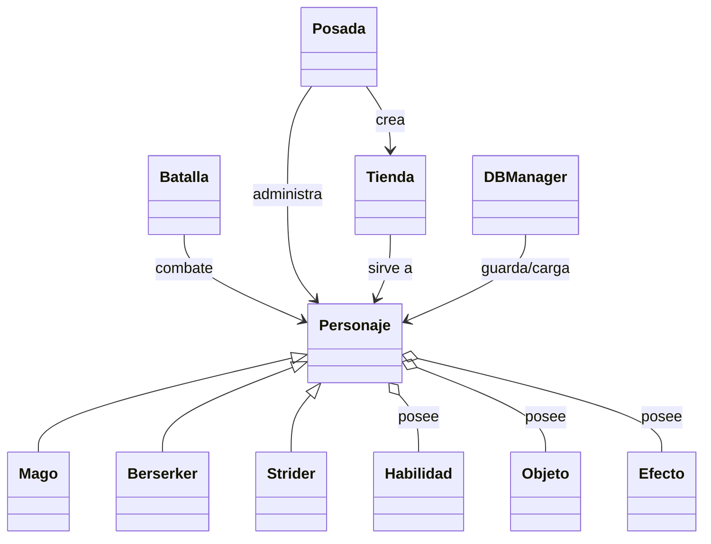

# Proyecto RPG

Juego de rol por turnos en Python con guardado en base de datos MySQL y un menú de posada.

## Descripción

Este proyecto es un RPG de consola con un sistema básico de combate por turnos, tres clases jugables y una integración inicial con base de datos para guardar y cargar personajes.

## Qué puede hacer

- Crear un personaje nuevo de clase `Mago`, `Berserker` o `Strider`.
- Cargar personajes guardados desde la base de datos.
- Visitar la posada y elegir entre:
  - Descansar y recuperar vida/magia/stamina.
  - Entrar a la tienda para comprar y vender objetos.
  - Ver estadísticas, habilidades y objetos del personaje.
  - Salir de aventuras para obtener botín (objetos o habilidades).
- Sistema de combate por turnos disponible en `app/engine/batalla.py`.
- Manejo de efectos sobre tiempo, como `Quemado`.
- Guardado de inventario y habilidades en la base de datos.

## Cómo ejecutar

1. Clonar el repositorio.
2. Desde la carpeta raíz ejecutar:
   ```bash
   docker compose up --build
   ```
3. Cuando termine la preparación, salir con `Ctrl+C`.
4. Detener y limpiar el servicio (solo la primera vez):
   ```bash
   docker compose down
   ```
5. Iniciar los contenedores en segundo plano:
   ```bash
   docker compose up -d
   ```
6. Ejecutar el juego dentro del contenedor:
   ```bash
   docker exec -it rpg_game python main.py
   ```

## Flujo de juego

1. El juego pide si deseas crear un personaje nuevo o cargar uno existente.
2. Si eliges crear, se ingresa nombre y clase, y el personaje se guarda en la base de datos.
3. Si eliges cargar, el sistema muestra los personajes guardados y carga inventario/habilidades.
4. Luego se ingresa a la posada, donde se puede descansar, comprar/vender, revisar estado o salir de aventuras.

## Estructura del código

- `app/main.py`: punto de entrada. Controla la creación/carga de personajes y arranca la posada.
- `app/bd/bd_manager.py`: gestiona conexión MySQL, guardado y carga de personajes, inventario y habilidades.
- `app/engine/batalla.py`: lógica de combate por turnos.
- `app/engine/posada.py`: menú principal del juego una vez iniciado el personaje.
- `app/engine/tienda.py`: tienda de compra/venta de objetos.
- `app/engine/objetos.py`: definición de objetos y pociones.
- `app/engine/habilidad.py`: definición de habilidades y reglas de uso.
- `app/engine/efectos.py`: efectos continuos como `Quemado`.
- `app/engine/cofre.py`: generación de botín aleatorio.
- `app/entidades/personaje.py`: clase base `Personaje` y métodos comunes.
- `app/entidades/berserker.py`, `app/entidades/mago.py`, `app/entidades/strider.py`: clases de personaje concretas.
- `app/entidades/factoryClases.py`: fábrica para crear/cargar personajes.
- `app/entidades/factoryHabilidades.py`: fábrica para cargar habilidades desde la base de datos.
- `app/entidades/factoryObjetos.py`: fábrica para cargar objetos desde la base de datos.

## Diagrama simplificado de clases

Este proyecto también incluye un diagrama de clases en `class_diagram.mmd`.



## Notas importantes

- El sistema de batalla existe, pero en `main.py` actualmente se inicia la posada en lugar de la pelea directa.
- La base de datos se espera disponible como servicio `db` en Docker.
- Las habilidades y objetos se guardan en la base de datos usando el nombre de la clase.

## Futuras mejoras

- Añadir más habilidades específicas por clase.
- Implementar más efectos de estado (hemorragia, aturdimiento, veneno, etc.).
- Permitir volver a entrar en batallas desde la posada.
- Añadir equipo y armaduras.
- Mejorar la interfaz de usuario de consola.

